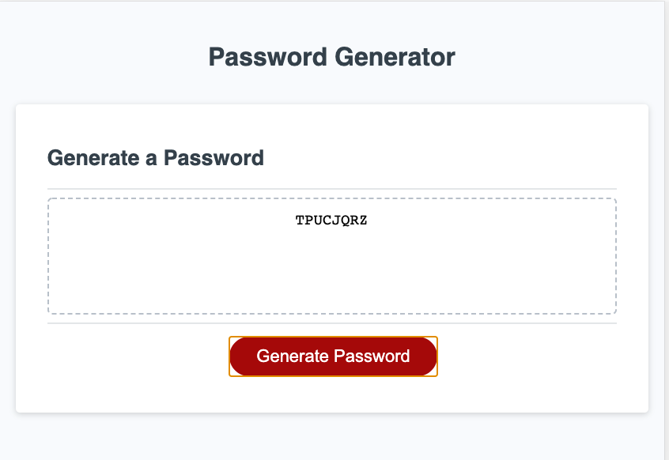
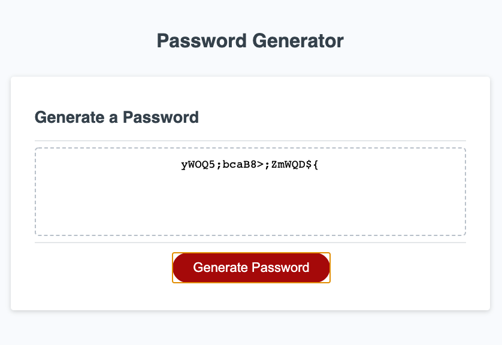

# Homework 2: Create Password (Java Script)

Functioning Website Link: https://jxiong15.github.io/02-create-password/
GitHub Repository Link: https://github.com/JXIong15/02-create-password

* Generates a random user specific password.

## Functionality:

* By clicking the sole red button, this program generates a random password specialized to the user's requests. First, the program creates an array of desired character, which can include, upper case letters, lower case letters, special characters, and/or numbers. 

* Afterwards, the program asks the user for the password's desired length. By iterating through a four loop, the originally empty password string adds a random character from the desired character set until the password is as long as the user specified password length.

